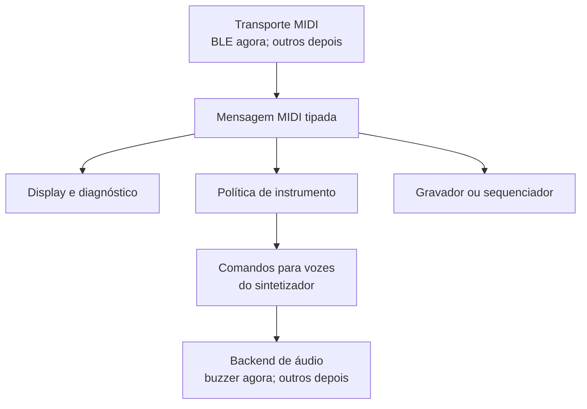

# Ecossistema modular para experimentos musicais embarcados

**Status:** rascunho de arquitetura e direção  
**Hardware inicial:** M5StickC Plus2  
**Primeiro componente:** [`fczuardi/midi-receiver`](https://github.com/fczuardi/midi-receiver)  
**Escopo:** referência para decisões, experimentos e possíveis projetos futuros

## Resumo

Este documento registra a direção descoberta durante a construção de um receptor BLE MIDI no M5StickC Plus2. A ideia nasceu da curiosidade sobre instrumentos compactos e baratos, como o M-Vave FM1, mas não pretende copiar, desmontar ou substituir um produto específico. Também não pressupõe que o resultado será um sintetizador FM.

A proposta é mais simples e mais aberta: construir pequenas peças de software musical embarcado que tenham valor isoladamente, possam ser combinadas e sejam apoiadas por contratos claros. O primeiro resultado concreto é um receptor BLE MIDI capaz de interpretar mensagens e expô-las de forma observável. O experimento seguinte poderá transformar essas mensagens em som usando apenas o buzzer interno do M5StickC Plus2.

O projeto privilegia aprendizado, reaproveitamento, código aberto e limites assumidos. Um aparelho monofônico de onda quadrada pode ser musicalmente interessante se responder bem, tiver uma interface legível e, mais tarde, ganhar recursos como arpejador ou sequenciador. Complexidade sonora não é requisito para validar a arquitetura.

## Contexto e motivação

Instrumentos baratos frequentemente parecem desproporcionais ao seu preço: combinam síntese, sequenciamento, arpejo, Bluetooth, carga de SysEx e interface física em um único objeto. Parte dessa eficiência provavelmente vem de componentes comuns, produção em escala e firmware altamente integrado. Entretanto, reaproveitar um aparelho proprietário pode exigir engenharia reversa, depender de componentes pouco documentados e produzir um resultado difícil de manter.

Uma alternativa é recriar a **experiência de exploração musical**, não o produto. Hardware disponível em casa e software aberto tornam essa direção mais realista e reutilizável. O computador Linux inicialmente considerado, inclusive Raspberry Pi Zero 2 W e Milk-V, acabou sendo menos atraente por preço, disponibilidade ou maturidade do ecossistema. O ESP32 já disponível no M5StickC Plus2 oferece BLE, processamento suficiente para MIDI, tela, bateria e buzzer em um pacote pequeno.

Placas Heltec V3 e V4, incluindo modelos com ESP32-S3 e LoRa, permanecem como possibilidades futuras. LoRa, USB host e outras expansões não fazem parte do escopo imediato.

## Princípios

1. **Experimentos pequenos e concluíveis.** Cada marco deve demonstrar algo utilizável sem depender de uma visão de produto distante.
2. **Componentes com valor próprio.** Um receptor, um instrumento de buzzer ou um sequenciador devem ser compreensíveis e testáveis isoladamente.
3. **Fronteiras semânticas.** Entre transporte e instrumento circulam mensagens MIDI interpretadas, não bytes ou pacotes BLE crus.
4. **Baixo custo previsível.** Estruturas de tamanho fixo, filas limitadas e ausência de alocação dinâmica no caminho crítico.
5. **Estado pertence ao consumidor.** A camada MIDI relata fatos; display e instrumento derivam estados diferentes desses fatos.
6. **Evolução motivada por uso real.** Código compartilhado só deve virar biblioteca quando dois consumidores reais revelarem a abstração necessária.
7. **Compatibilidade com padrões.** Os tipos internos se inspiram no MIDI, mas não tentam substituir o protocolo nem representar antecipadamente tudo o que ele oferece.
8. **Documentação sem marketing.** Registrar capacidades comprovadas, limitações e perguntas abertas.

## Estado atual: receptor BLE MIDI

O repositório `midi-receiver` representa a primeira milestone concluída. No M5StickC Plus2, ele:

- anuncia um endpoint BLE MIDI e aceita a conexão de um controlador;
- interpreta Note On e Note Off, incluindo número, nome da nota, canal e velocity;
- mantém múltiplas teclas ativas e representa acordes;
- entrega eventos por uma fila limitada;
- limpa notas e estado transitório ao desconectar;
- observa mensagens Control Change, incluindo sustain em CC64;
- interpreta Pitch Bend;
- mostra informações de diagnóstico na tela;
- possui testes nativos e integração contínua.

O `AppState` existente é útil para a tela e para o diagnóstico do receiver. Ele não deve ser promovido automaticamente a estado universal do ecossistema.

## Arquitetura proposta

### Nota de terminologia: “voz”

Neste documento, **voz** tem o sentido usado em sintetizadores: uma instância independente de geração sonora que toca uma nota. Um instrumento monofônico dispõe de uma voz; um instrumento com oito vozes pode, em princípio, manter até oito notas simultâneas. A voz reúne o que for necessário para produzir aquela nota — por exemplo frequência, amplitude, forma de onda e evolução no tempo.

Portanto, **voz não significa voz humana**, reconhecimento de fala ou comando ditado à máquina. Para evitar essa ambiguidade, o documento usa “comandos para as vozes do sintetizador” ou “comandos de execução sonora”, e não “comandos de voz”.



As fronteiras separam quatro responsabilidades:

| Camada | Responsabilidade | Não deve decidir |
| --- | --- | --- |
| Transporte | receber bytes, reconstruir mensagens e cuidar da conexão | timbre, vozes, sustain musical |
| MIDI semântico | representar mensagens reconhecidas com tipos estáveis | como cada consumidor reagirá |
| Instrumento | manter vozes e interpretar controles musicalmente | detalhes de BLE ou do display |
| Saída de áudio | produzir frequências e níveis no hardware | significado de Note On, CC ou bend |

Uma saída opcional de diagnóstico pode conservar pacotes crus, mas ela não é a API de instrumento.

## Por que não expor BLE MIDI cru

BLE MIDI é uma representação de transporte. Um pacote pode conter timestamps, múltiplas mensagens, running status, mensagens de tempo real intercaladas e fragmentos de SysEx. Obrigar cada consumidor a conhecer esses detalhes duplicaria parsing e ligaria toda a arquitetura ao Bluetooth.

Um wrapper tipado pequeno não representa custo relevante diante do rádio, atualização da tela e geração de áudio. Implementado com estruturas triviais e filas de capacidade fixa, ele também torna testes no computador simples e permite que outra origem — USB MIDI, arquivo, sequenciador ou interface local — produza as mesmas mensagens.

## Contrato MIDI interno

O contrato deve começar pequeno e crescer a partir de casos concretos. Um desenho indicativo, ainda não congelado, é:

```cpp
enum class MidiMessageType : uint8_t {
  NoteOn,
  NoteOff,
  ControlChange,
  PitchBend,
};

struct MidiMessage {
  MidiMessageType type;
  uint8_t channel;
  // Payload compacto específico do tipo.
};

struct TimedMidiEvent {
  MidiMessage message;
  uint32_t timestamp;
};
```

Conexão e desconexão pertencem ao ciclo de vida do transporte e podem usar um tipo separado. Isso evita fingir que são mensagens MIDI.

Também convém separar mensagem de tempo. Uma mensagem MIDI é útil sem relógio; um evento temporizado acrescenta o contexto de execução. Em MIDI ao vivo, o timestamp pode ser uma medida monotônica. Em um Standard MIDI File, o tempo normalmente é expresso como delta em ticks e interpretado junto com divisão temporal e eventos de tempo. Esses domínios não devem ser confundidos.

### Alinhamento com MIDI 1.0

- **Note On/Off:** carregam canal, nota e velocity. Note On com velocity zero deve poder ser normalizado como Note Off na borda de parsing.
- **Pitch Bend:** no fio usa dois valores de 7 bits, formando `0..16383`, com centro em `8192`. Internamente é conveniente normalizar para `-8192..8191`, centro zero, em `int16_t`.
- **Alcance do bend:** o valor não contém semitons. O instrumento escolhe ou recebe separadamente a faixa, muitas vezes ±2 semitons e configurável por RPN.
- **Modulation:** é Control Change 1 (CC1), normalmente `0..127`; não é uma mensagem dedicada como Pitch Bend. CC33 pode complementar CC1 como LSB de alta resolução.
- **Sustain:** é CC64. O receiver relata o controle; o instrumento decide quando notas soltas deixam de soar.

O destino sonoro de modulation não é prescrito pelo protocolo. Um instrumento pode mapear CC1 para vibrato, tremolo, filtro ou outro parâmetro. Controles físicos também podem mudar de função conforme o modo do controlador; o receiver serve para observar o que realmente foi enviado.

## Estado e fluxo de eventos

Não há necessidade de um único objeto global de estado musical. A mesma mensagem alimenta reduções diferentes:

- o display guarda último evento, contagens e controles observados;
- o instrumento guarda teclas pressionadas, vozes soando, notas sustentadas, bend e modulation por canal;
- um gravador guarda eventos e seus tempos;
- um monitor pode apenas escrever um log.

Sustain demonstra por que essa separação importa: “tecla pressionada” e “voz soando” deixam de ser equivalentes quando o pedal está ativo.

Um estado de performance por canal poderá assumir uma forma semelhante a:

```cpp
struct ChannelPerformanceState {
  int16_t pitchBend = 0;
  uint8_t modulation = 0;
  bool sustain = false;
};
```

Esse tipo pertence ao instrumento ou a uma camada de performance, não necessariamente ao receiver.

## Primeiro módulo de áudio: buzzer

O M5StickC Plus2 inclui um buzzer passivo no GPIO 2. Ele é adequado para a próxima prova de conceito: transformar Note On/Off em uma onda quadrada audível. A biblioteca M5Unified já fornece primitivas como `Speaker.tone`, portanto não há motivo para inventar imediatamente uma grande API de áudio.

Mesmo uma nota C4 não precisa ter um único timbre possível. Duty cycle, articulação, envelopes simples, alternância rápida de frequência, vibrato e mistura por software podem alterar o resultado. Entretanto, essas possibilidades são posteriores à validação do caminho básico.

Para execução ao vivo, uma API baseada apenas em `play(frequência, duração)` é insuficiente: a duração não é conhecida no Note On. A fronteira entre instrumento e backend pode começar conceitualmente assim:

```cpp
startVoice(VoiceId id, float frequencyHz, uint8_t level);
setVoiceFrequency(VoiceId id, float frequencyHz);
stopVoice(VoiceId id);
stopAll();
```

Uma função `playTone(frequency, duration)` pode existir como conveniência para melodias e sequenciadores, construída sobre essas operações. O backend de buzzer não deve conhecer MIDI. Ele recebe comandos de execução sonora; a política de instrumento converte mensagens MIDI nesses comandos.

O primeiro marco de áudio deve permanecer modesto:

> Receber Note On e Note Off e controlar uma única voz de onda quadrada no buzzer interno, silenciando-a corretamente também na desconexão.

Decisões como prioridade de notas em modo monofônico — última nota, nota mais alta ou nota mais baixa — devem ficar na política de instrumento. Polifonia, sustain, bend e modulation vêm depois que o ciclo básico estiver confiável.

## Outros caminhos de áudio

Há opções para evoluir além do buzzer:

- mistura por software e canais virtuais do M5Unified;
- Speaker HAT ou hardware equivalente;
- amplificador I²S MAX98357A ligado a um alto-falante;
- DAC I²S PCM5102 para saída de linha;
- eventualmente Bluetooth A2DP, embora latência, coexistência com BLE e maior complexidade tornem essa opção ruim para a primeira saída interativa.

As placas MAX98357A e PCM5102 já disponíveis são candidatas interessantes a experimentos posteriores. Elas não devem contaminar a API com detalhes específicos antes de existir um segundo backend real.

## Organização dos repositórios

A organização recomendada é incremental:

1. Manter `midi-receiver` como projeto focado e milestone fechada, marcada por uma versão inicial.
2. Criar um projeto separado para o experimento de buzzer, inicialmente capaz de funcionar sozinho.
3. Integrar o receptor ao instrumento dentro desse projeto, copiando ou adaptando a menor quantidade necessária.
4. Só extrair uma biblioteca MIDI compartilhada quando receiver e instrumento demonstrarem concretamente o contrato comum.
5. Criar um repositório guarda-chuva apenas quando houver pelo menos duas peças maduras e uma relação que valha documentar.

Nem todo módulo lógico precisa ser um repositório. Política de instrumento, alocação de vozes e backend do buzzer podem começar como módulos internos do projeto de áudio. Separação física prematura aumenta versionamento, dependências e manutenção sem comprovar reutilização.

## Ferramentas e ambiente

PlatformIO com framework Arduino foi escolhido por oferecer builds reproduzíveis, dependências explícitas, testes nativos e boa integração com CI, preservando o acesso ao ecossistema Arduino e ao M5Unified. Arduino IDE continuaria válida para sketches exploratórios, mas oferece menos estrutura para um conjunto de projetos que pretende crescer com testes.

## Prior art relevante

- [`probonopd/MiniDexed`](https://github.com/probonopd/MiniDexed): implementação bare metal de Dexed para Raspberry Pi; prova que uma experiência DX7 pode existir sem Linux completo, mas exige uma classe de hardware diferente.
- [`williamd1k0/m5-synth`](https://github.com/williamd1k0/m5-synth): referência direta para BLE MIDI e síntese no M5StickC Plus2, incluindo buzzer, formas de onda e múltiplas vozes. Sua topologia Bluetooth é diferente: atua como cliente que procura um controlador, enquanto `midi-receiver` anuncia um periférico BLE MIDI.
- [`bstein2379/M5StickC-Plus-Ringtone-Jukebox`](https://github.com/bstein2379/M5StickC-Plus-Ringtone-Jukebox): demonstra melodias RTTTL no buzzer interno.
- [`CITROMOSEPER/MIDIplayer`](https://github.com/CITROMOSEPER/MIDIplayer): exemplo de reprodução não bloqueante de melodias com FreeRTOS; apesar do nome, não é necessariamente um parser de Standard MIDI Files.

Prior art orienta e reduz redescobertas, mas não define a arquitetura. Diferenças de papel BLE, dependências, licença e objetivo precisam ser verificadas antes de reutilizar código.

## Roadmap indicativo

### Marco 0 — receiver concluído

- BLE MIDI funcional;
- mensagens essenciais interpretadas;
- acordes e controles observáveis;
- testes, CI e documentação;
- tag inicial de milestone.

### Marco 1 — instrumento monofônico de buzzer

- geração básica de frequência por nota;
- Note On inicia a voz;
- Note Off encerra a voz correta;
- política explícita para múltiplas teclas;
- silêncio garantido na desconexão;
- testes da conversão nota–frequência e da política de voz.

### Marco 2 — expressão mínima

- velocity mapeada para o parâmetro que o hardware realmente permitir;
- pitch bend contínuo;
- sustain;
- modulation com um destino simples, provavelmente vibrato.

### Marco 3 — brinquedo autônomo

- arpejador ou sequenciador pequeno;
- controles e feedback na tela;
- reprodução sem controlador externo;
- formato de sequência explicitamente definido, ou adaptação correta de SMF quando isso se justificar.

### Marcos posteriores possíveis

- polifonia por mistura de software;
- backends I²S;
- USB MIDI host em hardware ESP32-S3 apropriado;
- outras origens de eventos;
- sincronização ou experimentos LoRa;
- repositório guarda-chuva e biblioteca comum.

Esses itens são possibilidades, não compromissos.

## Riscos e perguntas abertas

- Qual latência total BLE–evento–som será percebida no buzzer?
- Como o M5Unified disputa timers e recursos com BLE, display e outros periféricos?
- Qual política monofônica é mais divertida e previsível?
- Velocity pode produzir volume útil no buzzer ou deve controlar outra dimensão?
- Quando a mistura de vozes deixa de ser musicalmente aceitável no transdutor interno?
- Qual é a menor interface compartilhada que sobrevive a dois consumidores reais?
- O sequenciador deve armazenar eventos internos, um subconjunto de MIDI ou Standard MIDI Files?
- Quais licenças do prior art permitem reaproveitamento direto?

## Critérios para boas decisões

Uma mudança está alinhada com esta proposta quando:

- pode ser demonstrada e testada em isolamento;
- mantém transporte, semântica MIDI, política musical e hardware separados;
- não exige abstração maior do que os casos presentes;
- melhora a capacidade de combinar ou reaproveitar uma peça;
- deixa as limitações visíveis;
- oferece algum resultado musical ou educativo mesmo antes do produto imaginado existir.

## Norte

O objetivo não é decidir cedo demais qual instrumento está sendo construído. É criar um terreno onde diferentes instrumentos pequenos possam surgir da mesma linguagem de eventos: um receiver com tela, um buzzer monofônico, um arpejador, um sequenciador, um sintetizador ou algo que ainda não foi imaginado.

A unidade de progresso é uma experiência que funciona. A unidade de arquitetura é uma fronteira que continua clara quando uma segunda peça aparece.
