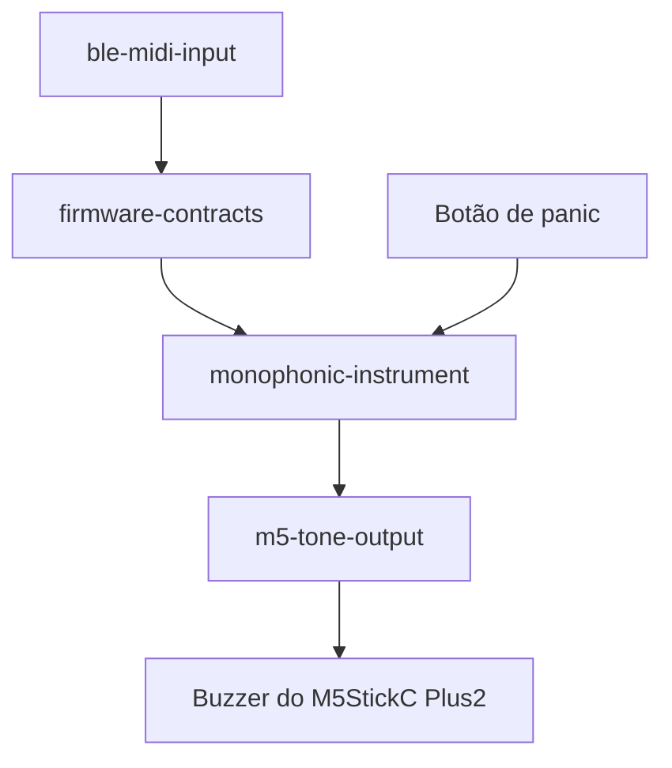
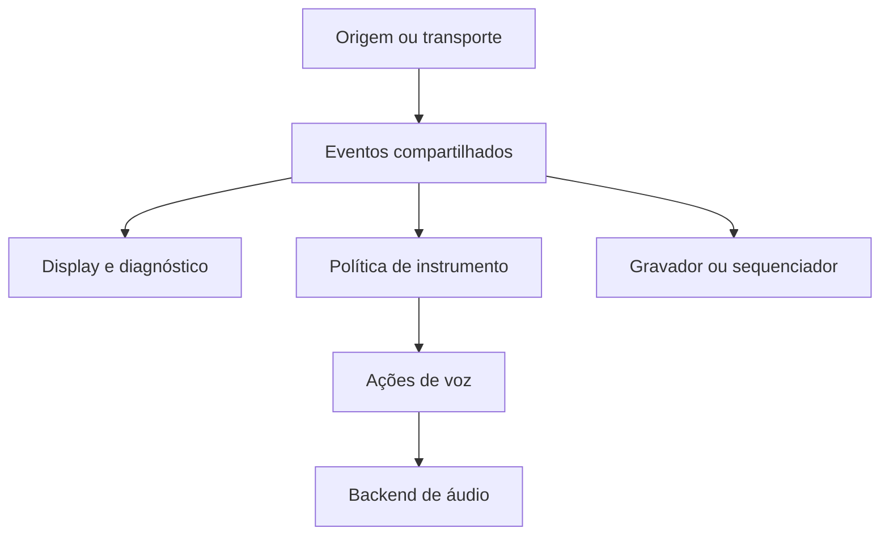
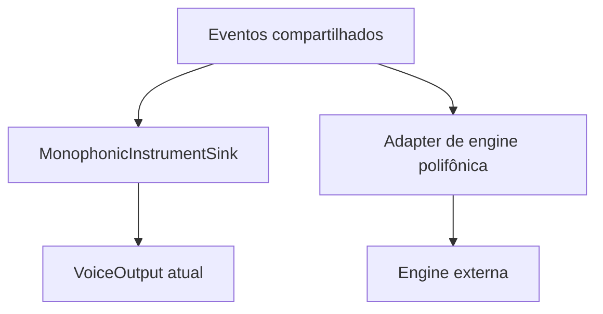

# Ecossistema modular para experimentos musicais embarcados

**Status:** documento vivo de arquitetura e direção

**Última revisão:** 2026-09-21

**Hardwares de validação atuais:** M5StickC Plus2 e M5Stack Core Gray 1.0

**Hardware de exploração disponível:** M5Stick S3

**Escopo:** contratos, componentes e experiências musicais embarcadas combináveis

## Resumo

Este projeto investiga como construir pequenos sistemas musicais embarcados a
partir de módulos que tenham valor isoladamente e possam ser combinados por
fronteiras explícitas. Ele não define um sintetizador único nem pretende copiar
um produto comercial específico.

O valor procurado também não é substituir os muitos sintetizadores completos
que já existem em celulares e computadores. O experimento explora outra coisa:
dar função musical a pequenos objetos físicos, inclusive gadgets esquecidos,
preservando seus botões, telas, limitações e caráter de brinquedo. Aprendizado,
reaproveitamento e limitação criativa são resultados válidos mesmo quando uma
composição não se transforma em produto.

A implementação atual já ultrapassou a primeira prova de conceito. Hoje o
ecossistema possui:

- contratos C++ compartilhados para nota, pitch bend, Control Change e ciclo
  de vida;
- uma entrada BLE MIDI reutilizável;
- um instrumento monofônico com prioridade da última nota;
- backends simples para o buzzer do M5StickC Plus2 e o speaker do Core Gray;
- uma integração AMY que preserva nota, velocity, canal, patch, pitch bend e
  CC1 até uma engine de síntese completa;
- três showcases validados em hardware: buzzer no Plus2, tone output no Core
  Gray e AMY no Core Gray;
- testes nativos, builds de firmware, pacotes PlatformIO, limites explícitos de
  memória e registros de validação em hardware.

O M5StickC Plus2 e o M5Stack Core Gray formam a baseline atual de hardware. O
Plus2 preserva o caminho mínimo pelo buzzer; o Gray oferece speaker e recursos
suficientes para a integração AMY. O M5Stick S3 está disponível para a próxima
exploração de USB MIDI host, mas ainda não faz parte da baseline comprovada.

As composições atuais ainda recebem o Arturia MicroLab por uma ponte USB MIDI
para BLE MIDI executada no Android. Isso é uma limitação conhecida, mas também
separa duas linhas de investigação: tornar a entrada autônoma e ampliar a voz
sonora são problemas independentes.

## O que estamos construindo

O resultado pretendido não é uma aplicação monolítica. É um pequeno ecossistema
no qual origens de eventos, políticas musicais, saídas sonoras e interfaces
possam ser recombinadas.

| Papel | Implementação atual | Possibilidades futuras |
| --- | --- | --- |
| Origem de eventos | BLE MIDI | USB MIDI host, sequenciador, controles locais |
| Contrato | nota, pitch bend, Control Change e desconexão | tempo, Program Change e outros eventos quando necessários |
| Política musical | monofonia com última nota; seleção de patch por canal na AMY | sustain executável, arpejo, sequenciamento, polifonia |
| Saída sonora | tone output M5 e AMY PCM no Core Gray | outras engines, I²S e synths externos |
| Composição | três showcases BLE MIDI em Plus2 e Core Gray | novos showcases por origem, hardware ou combinação |

Cada nova peça deve resolver um caso concreto. Generalizações surgem quando uma
segunda implementação ou composição revela o que realmente precisa ser comum.

O roadmap mantém dois eixos independentes:

- **autonomia de entrada:** remover a ponte Android através de USB MIDI host ou
  outra composição física;
- **riqueza sonora:** integrar engines existentes ou novos backends atrás dos
  contratos semânticos já comprovados.

Os dois eixos agora possuem hardware disponível. O Core Gray sustenta a linha
de engines e controles locais; o M5Stick S3 permite investigar USB MIDI host.
A ordem dos experimentos e seus critérios de saída pertencem ao
[`docs/ROADMAP.md`](docs/ROADMAP.md), não a este documento.

## Estado comprovado

### Contratos compartilhados

O repositório guarda-chuva é também o pacote PlatformIO
`firmware-contracts`. Ele publica, atualmente:

- `NoteEvent`, com tipo, canal, nota e velocity;
- `PitchBendEvent`, com canal e valor centrado em `-8192..8191`;
- `ControlChangeEvent`, com canal, número do controlador e valor `0..127`;
- `InstrumentEventSink`, consumido por instrumentos e implementado sem conhecer
  BLE, display ou hardware de áudio;
- `onDisconnected()`, uma notificação de ciclo de vida usada para limpeza segura.

O contrato continua deliberadamente pequeno. CC atravessa a fronteira como
mensagem semântica genérica; a interpretação de CC1, CC64 ou qualquer outro
controlador pertence ao instrumento. Program Change, relógio e timestamps
permanecem fora até que uma composição real exija sua semântica.

### Entrada BLE MIDI

O repositório [`midi-receiver`](https://github.com/fczuardi/midi-receiver)
contém dois papéis relacionados, mas separados:

- `BleMidiInput` cuida do transporte BLE MIDI, normalização, fila limitada e
  entrega de eventos ao `InstrumentEventSink`;
- a aplicação receiver acrescenta `AppState`, display e diagnóstico serial para
  tornar o tráfego observável no M5StickC Plus2.

A parte reutilizável é publicada como `ble-midi-input`. Consumidores não precisam
copiar a implementação BLE nem importar o display do receiver.

O receiver já foi validado em hardware com conexão e reconexão, Note On/Off,
acordes, canais, velocity, Control Change, sustain observado em CC64, pitch bend,
fila de eventos e limpeza após desconexão.

### Instrumento monofônico e saída de buzzer

O repositório [`monophonic-instrument`](https://github.com/fczuardi/monophonic-instrument)
publica `monophonic-instrument` e `m5-tone-output`. Internamente, ele separa:

- conversão de nota MIDI para frequência;
- estado monofônico e prioridade da última nota ainda pressionada;
- adaptação de eventos compartilhados para ações do instrumento;
- interface de saída de voz;
- implementação física com `M5.Speaker`.

O instrumento preserva velocity por nota e o backend a mapeia para uma faixa de
volume calibrável. A ação local de panic limpa o estado de teclas mantidas e
silencia imediatamente a saída. Pitch bend é armazenado como estado musical,
mapeado para uma faixa configurável de semitons e entregue ao backend como uma
frequência já calculada.

### Integração AMY

O repositório [`amy-synth-m5`](https://github.com/fczuardi/amy-synth-m5)
publica uma fachada que implementa `InstrumentEventSink` diretamente e dirige
a engine AMY no M5Stack Core Gray. Ela não passa por `VoiceOutput`: preserva
conceitos de nível musical que a engine entende nativamente, como nota,
velocity, patch, pitch bend e modulação.

A configuração validada contém um slot AMY globalmente monofônico e uma tabela
fixa de 16 patches, um para cada canal MIDI. Mudar de canal seleciona timbre; não
cria 16 vozes nem um sintetizador multitimbral. A política de última nota é
global entre canais, e a volta para uma tecla ainda pressionada também restaura
o patch correspondente.

CC1 usa um perfil de performance inspirado no Juno: um único mapping por canal
expande para comandos compostos nos osciladores tonais do patch ativo. A
topologia concreta continua sendo responsabilidade da integração AMY, não do
contrato genérico de Control Change. Estado contínuo como bend e modulação é
preservado e reaplicado quando uma troca de patch exige reconstruir a voz.

A versão validada pelo Showcase 3 é `amy-synth-m5@0.3.1`. Como a combinação
AMY, BLE e framework ocupa praticamente toda a IRAM física do ESP32 clássico, o
CI trata IRAM, DRAM e tamanho da imagem como orçamentos explícitos e publica
artefatos de memória para inspeção.

### Composições executáveis

`showcases/ble-midi-buzzer` combina os pacotes para o M5StickC Plus2:

O showcase foi validado com um controlador BLE MIDI real para tocar, soltar e
sobrepor notas, responder à velocity, executar panic, silenciar na desconexão e
reconectar. O caminho completo de pitch bend audível também foi validado pela
rota responsiva do SynthBridge. Testes comparativos separaram uma limitação
externa: My MIDI Hub atrasou Note Off ao rotear a fita física do Arturia por USB
OTG para BLE, enquanto SynthBridge parou notas imediatamente. Essa é uma
observação específica da rota, não uma falha do contrato compartilhado, da
política do instrumento ou do backend de buzzer.

`showcases/ble-midi-core-gray-speaker` usa a mesma lógica de composição e troca
apenas a borda de hardware para `M5CoreGrayToneOutput`, o alvo
`m5stack-core-esp32`, o nome BLE anunciado e a calibração de volume. A primeira
validação em hardware passou com SynthBridge no Android após limpar estado BLE
obsoleto do app/sistema. O Core Gray tocou notas, respondeu bem a pitch bend e
reproduziu notas graves melhor que o buzzer do Plus2.

`showcases/ble-midi-amy` compõe `ble-midi-input` diretamente com
`AmyM5MonophonicSynth` no Core Gray. O showcase usa o banco validado de 16
patches, CC1 no perfil Juno, pitch bend, velocity, panic e limpeza na
desconexão. Os atalhos de canal 1–16 do Arturia foram exercitados em hardware,
incluindo fallback monofônico entre canais e a regressão de centralização do
bend antes da nota seguinte.

Essas composições são exemplos executáveis, não produtos adicionais. Elas
pertencem ao guarda-chuva porque provam que pacotes independentes realmente
encaixam.

## Princípios

1. **Experimentos pequenos e concluíveis.** Cada slice deve produzir evidência
   observável, documentação e um estado coerente do código.
2. **Componentes com valor próprio.** Receiver, instrumento, backend e showcase
   devem continuar compreensíveis isoladamente.
3. **Fronteiras semânticas.** Instrumentos recebem eventos interpretados, não
   pacotes BLE ou bytes MIDI crus.
4. **Estado pertence ao consumidor.** Display, instrumento e gravador podem
   derivar estados diferentes do mesmo evento.
5. **Recursos previsíveis.** Filas e coleções no caminho crítico usam capacidade
   limitada e evitam alocação dinâmica.
6. **Evolução motivada por uso real.** Uma abstração compartilhada precisa ser
   justificada por produtores, consumidores ou hardwares concretos.
7. **Diferenças ficam nas bordas.** Pinagem, inicialização, calibração, display e
   botões pertencem à composição ou ao backend específico.
8. **Portabilidade demonstrada.** Compilar não basta; a mesma fronteira deve ser
   exercitada em dispositivos reais.
9. **Documentação sem marketing.** Capacidade comprovada, limitação conhecida e
   hipótese futura devem aparecer como categorias diferentes.

## Arquitetura

| Camada | Responsabilidade | Não deve decidir |
| --- | --- | --- |
| Origem/transporte | receber dados, reconstruir mensagens e cuidar da conexão | timbre, prioridade de notas, faixa musical do bend |
| Contratos | representar fatos já interpretados | como cada consumidor reage |
| Instrumento | manter estado musical e produzir ações de voz | detalhes de BLE, display ou pinagem |
| Saída de áudio | transformar ações em som físico | significado de Note On, canal ou CC |
| Composição | escolher módulos, configuração e controles do aparelho | reimplementar as responsabilidades internas |

### Engines completas não são uma única voz

`VoiceOutput` representa a borda simples usada pelo instrumento monofônico
atual: iniciar, atualizar ou parar uma voz. Uma engine polifônica madura não deve
ser forçada a caber nessa abstração e perder sua própria alocação de vozes,
envelopes, patches ou operação multitimbral.

A integração AMY confirmou que uma engine completa pode implementar
`InstrumentEventSink` diretamente:

Esse caminho já foi provado sem transformar `VoiceOutput` numa abstração
universal. A AMY também confirmou uma borda concreta entre a engine que produz
PCM e a ponte que entrega amostras ao speaker do Core Gray. Ainda não existe
evidência suficiente para promover essa borda específica a um contrato comum
entre engines.

### Instrumentos orientados a performance e synths MIDI externos

A integração da AMY revelou uma distinção que o backend de tons simples não
precisava expressar. Há pelo menos três formas diferentes de chegar ao som:

| Caminho | Entrada útil | Responsabilidade de saída |
| --- | --- | --- |
| `VoiceOutput` atual | frequência, nível e waveform | produzir diretamente um tom |
| Engine em software, como AMY | nota, velocity, patch e controles expressivos | renderizar blocos PCM |
| Synth externo, como SAM2695 | mensagens de performance MIDI | produzir áudio pronto em hardware dedicado |

O M5Stack Unit Synth é prior art útil para a terceira forma. Seu SAM2695 contém
wavetable General MIDI, síntese, alocação polifônica, efeitos e DAC. O
microcontrolador envia comandos MIDI por UART; a biblioteca oficial oferece
operações de nota, programa/banco, pitch bend e seu alcance, volume, expression,
pan, efeitos e all-notes-off. Essa implementação é muito diferente da AMY, mas
ambas preservam a intenção musical por mais tempo do que um backend que recebe
somente frequência.

Isso reforça que a fronteira compartilhada deve continuar semântica:

- `NoteEvent`, `PitchBendEvent`, `ControlChangeEvent`, desconexão e panic
  já descrevem intenções úteis para os três caminhos;
- patch é estado específico do instrumento, enquanto MIDI Program Change é uma
  possível mensagem compartilhada;
- o alcance do pitch bend é configuração do instrumento, separado da posição
  instantânea recebida;
- canal torna-se musicalmente relevante quando um engine ou módulo oferece
  programas diferentes, multitimbralia ou efeitos por canal;
- um consumidor pode ignorar eventos que não façam parte de suas capacidades.

A API do Unit Synth não deve ser copiada como interface universal. Ela mistura
mensagens MIDI padronizadas, SysEx e controles específicos do chip em uma única
classe de driver. Seu valor aqui é servir como evidência de vocabulário e
composição. Um futuro `ProgramChangeEvent` só deve ser acrescentado quando uma composição
real possuir produtor e consumidor para ele. Control Change já possui ambos e
permanece genérico no contrato compartilhado.

Fontes:

- [M5Stack Unit Synth](https://docs.m5stack.com/en/unit/Unit-Synth)
- [SAM2695 datasheet](https://m5stack.oss-cn-shenzhen.aliyuncs.com/resource/docs/products/unit/Unit-Synth/SAM2695.pdf)
- [M5Unit-Synth Arduino API](https://github.com/m5stack/M5Unit-Synth/blob/main/src/M5UnitSynth.h)
- [General MIDI instrument definitions](https://github.com/m5stack/M5Unit-Synth/blob/main/src/M5UnitSynthDef.h)

### Por que não expor BLE MIDI cru

BLE MIDI é uma representação de transporte. Seus pacotes podem conter
timestamps, várias mensagens, running status, mensagens de tempo real
intercaladas e fragmentos de SysEx. Fazer cada consumidor entender esses
detalhes duplicaria parsing e prenderia instrumentos ao Bluetooth.

Estruturas semânticas pequenas permitem que BLE MIDI, USB MIDI, um sequenciador
ou controles locais produzam a mesma intenção musical. Também permitem testar
a política do instrumento no computador, sem rádio ou hardware.

### Mensagens e tempo

O contrato compartilhado ainda não inclui timestamps. Isso é intencional: Note
On, Note Off ou Pitch Bend são úteis sem relógio para execução ao vivo. Quando
um gravador ou sequenciador concreto precisar de tempo, um evento temporizado
poderá envolver a mensagem sem alterar seu significado.

Tempo monotônico de uma performance ao vivo, delta em ticks de um Standard MIDI
File e sincronização externa são domínios diferentes. Eles não devem ser
fundidos antes de existir um caso que escolha a semântica necessária.

## Terminologia: voz

Neste documento, **voz** é uma instância independente de geração sonora capaz
de executar uma nota. Um instrumento monofônico tem uma voz; um instrumento de
oito vozes pode, em princípio, manter oito notas simultâneas.

O termo não significa voz humana ou reconhecimento de fala. Para evitar a
ambiguidade de “comando de voz”, usamos **ação de voz** ou **comando de execução
sonora**.

## Semântica MIDI atual

- **Note On/Off:** usam canal, nota e velocity. Note On com velocity zero é
  normalizado como Note Off na borda produtora.
- **Pitch Bend:** os dois valores de 7 bits do MIDI formam `0..16383`, com centro
  em `8192`. O contrato usa `int16_t` centrado em `-8192..8191`.
- **Alcance do bend:** o evento não contém semitons. O instrumento escolhe a
  faixa musical; o pacote atual usa ±2 semitons por padrão e permite que a
  composição sobrescreva esse valor.
- **Modulation:** CC1 expressa intensidade, normalmente em `0..127`, mas o
  instrumento escolhe o destino — vibrato, tremolo, timbre ou outro parâmetro.
- **Sustain:** CC64 informa a posição do pedal. A decisão de manter uma nota
  soando pertence ao instrumento.
- **Panic:** não é inferido de silêncio. Pode ser uma ação local explícita ou uma
  reação a desconexão e, futuramente, a CC120/CC123.

Conexão e desconexão são eventos do ciclo de vida do transporte, não mensagens
MIDI. Ainda assim, a desconexão precisa atravessar a composição porque um
instrumento deve silenciar notas que perderam seu Note Off.

## Estado musical e estado de diagnóstico

Não existe um estado global universal. A mesma mensagem pode alimentar modelos
diferentes:

- o receiver guarda conexão, última atividade, contagens e notas observadas;
- o instrumento atual guarda teclas pressionadas, nota ativa, velocity e pitch
  bend;
- um sequenciador guardará eventos e relações temporais;
- um monitor pode apenas registrar dados.

Essa separação fica especialmente importante com sustain: tecla pressionada e
voz soando deixam de ser equivalentes.

## Estratégia de áudio

### Backend atual

O `m5-tone-output` usa a abstração `M5.Speaker` para tocar tabelas curtas de
onda square ou saw no buzzer passivo do M5StickC Plus2 e no speaker interno do
M5Stack Core Gray. Ele provou pitches reconhecíveis, início e parada, troca de
nota e resposta básica à velocity no Plus2; o caminho BLE MIDI equivalente para
o Core Gray também tocou em hardware real, com melhor resposta perceptível em
notas graves e pitch bend responsivo.

Esse backend permanece como baseline para Note On/Off, velocity, panic e pitch
bend. Ele já demonstrou movimento audível nas duas direções por uma rota BLE
responsiva. O comportamento do My MIDI Hub sob tráfego denso de bend permanece
como limitação externa documentada, não como motivo para redesenhar agora o
transporte.

O pacote oferece defaults conservadores — volume `64..128` e pitch bend de ±2
semitons — enquanto composições podem sobrescrever ambos. O showcase atual usa
volume `96..136` e pitch bend de ±4 semitons para demonstrar essa fronteira de
calibração sem modificar nenhum dos pacotes reutilizáveis.

### Backends paralelos

Novos caminhos de áudio devem começar ao lado do backend atual:

- oscilador contínuo por amostras;
- speaker interno do M5Stack Core Gray;
- amplificador I²S MAX98357A;
- DAC I²S PCM5102 para saída de linha;
- outras saídas motivadas por hardware disponível.

O projeto deve preferir integrar trabalho Open Source maduro a reimplementar
síntese já bem explorada. Os candidatos atuais não são intercambiáveis:

- **AMY:** sintetizador completo com polifonia, presets, FM, samples, envelopes
  e efeitos; já integrado e validado no Core Gray por uma fachada
  `InstrumentEventSink`;
- **ESP32Synth:** engine recente e otimizada especificamente para a família
  ESP32, com vários modos de saída e ampla capacidade declarada;
- **esp32_fm_synth:** implementação de referência de um sintetizador FM
  multitimbral para ESP32; o projeto original está descontinuado e aponta para
  um sucessor ainda pouco documentado;
- **TinySoundFont:** renderer de SoundFont 2 para instrumentos baseados em
  samples;
- **Mozzi:** toolkit maduro e pedagógico de osciladores, envelopes, filtros e
  saída de áudio para microcontroladores;
- **Faust:** linguagem e toolchain capaz de gerar DSP C++ para ESP32.

Cada novo candidato deve começar isolado, sem BLE, e demonstrar som no hardware
antes de receber um adapter para os contratos compartilhados. A AMY já percorreu
esse caminho e serve como evidência para o método. A integração deve
preservar a dependência externa e sua licença, não copiar silenciosamente a
engine para dentro do ecossistema.

Chips sonoros físicos formam outra categoria. Uma biblioteca como `AY3891x`
permite que um microcontrolador programe um PSG AY-3-8910, AY-3-8912 ou YM2149,
mas não produz áudio nos transdutores M5 existentes. Ela exige o chip, clock,
barramento paralelo, vários GPIOs e circuito de áudio próprios. Esse caminho é
coerente com o interesse em objetos musicais peculiares, porém pertence a uma
exploração futura de hardware, não à comparação imediata de engines em software.

Um backend novo não precisa substituir o anterior. Dois exemplos podem continuar
úteis se evidenciarem compromissos diferentes de latência, qualidade, memória,
CPU ou simplicidade.

Polifonia, envelopes e múltiplos osciladores são experimentos posteriores.
Trabalhos futuros de expressão contínua devem continuar separando duas questões:
transporte responsivo para eventos discretos e backend sonoro capaz de atualizar
frequência sem artefatos perceptíveis.

## Segundo hardware: M5Stack Core Gray

O Core Gray 1.0 foi introduzido como segundo hardware de validação. Ele mantém
proximidade suficiente — ESP32 clássico, BLE e M5Unified — mas troca o buzzer
passivo por um speaker eletromagnético interno de 1 W ligado ao DAC do ESP32.

Essa combinação validou, em ordem:

1. A4 e parada no speaker, sem BLE;
2. configuração comum ou backend separado para a saída;
3. build de firmware para o segundo alvo;
4. composição BLE MIDI completa;
5. comparação de volume, clareza, velocity, bend, cliques e latência.

O showcase do Plus2 permanece como referência. Não queremos convertê-lo numa
aplicação universal cheia de condicionais de placa. A composição do Gray pode
escolher outro backend, layout e botão, mantendo contratos e política musical.

Uma passagem posterior confirmou no Gray Note On/Off, pitch bend, velocity,
panic local, limpeza na desconexão, reconexão e fallback entre teclas
sobrepostas. A milestone de dois hardwares é uma baseline concluída, não uma
promessa de compatibilidade automática com qualquer ESP32.

## Organização e distribuição

| Local | Responsabilidade |
| --- | --- |
| `embedded-music-experiments` | design, roadmap, contratos compartilhados e showcases |
| `midi-receiver` | experimento de diagnóstico e pacote reutilizável de entrada BLE MIDI |
| `monophonic-instrument` | política monofônica e pacote reutilizável de saída/instrumento |
| `amy-synth-m5` | integração AMY, fachada de instrumento e ponte PCM para hardware M5 |

Os quatro repositórios usam PlatformIO com Arduino e dependências explícitas. Cada
pacote possui `library.json`; o showcase fixa revisões das dependências para que
uma composição validada possa ser reproduzida. CI verifica contratos, testes
nativos, empacotamento e builds relevantes.

Nem todo módulo lógico precisa virar repositório. Um novo repositório se
justifica quando a peça tem ciclo de vida e valor próprios; uma combinação
executável pequena normalmente pertence a `showcases/`.

## Forma de progresso

O projeto avança por slices pequenos que possam ser construídos, testados,
documentados, revisados e, quando necessário, tocados no hardware. Devlogs
preservam tentativas e descobertas empíricas; este documento descreve a
arquitetura vigente; [`docs/ROADMAP.md`](docs/ROADMAP.md) ordena os próximos
testes; [`docs/BACKLOG.md`](docs/BACKLOG.md) guarda possibilidades de menor
certeza.

O [`radar de semânticas de interação`](docs/design/interaction-semantics-radar.md)
registra comportamentos já usados por instrumentos e softwares musicais, como
trigger, gate, latch, probability e micro-timing. O radar preserva vocabulário,
fontes e hipóteses; seus itens não são automaticamente contratos nem compromissos
de roadmap. Uma ideia só atravessa essa fronteira quando experimentos locais
revelam produtores e consumidores reais para ela.

O Git e os devlogs contam como chegamos aqui. Este documento não precisa repetir
essa cronologia nem funcionar como changelog.

## Prior art relevante

- [`williamd1k0/m5-synth`](https://github.com/williamd1k0/m5-synth): BLE MIDI,
  formas de onda e múltiplas vozes no M5StickC Plus2; usa topologia Bluetooth
  diferente da entrada atual.
- [`necobit/M5Stack-MIDI-Module`](https://github.com/necobit/M5Stack-MIDI-Module):
  síntese por osciladores e acordes no M5Stack; inspira a exploração paralela de
  áudio amostrado, sem determinar nossa arquitetura.
- [`shorepine/amy`](https://github.com/shorepine/amy): engine completa e
  polifônica, com presets, síntese e renderização de buffers PCM.
- [`danilogcrf2-oss/ESP32Synth`](https://github.com/danilogcrf2-oss/ESP32Synth):
  engine otimizada para ESP32 com PWM, DAC, PDM e I²S.
- [`marcel-licence/esp32_fm_synth`](https://github.com/marcel-licence/esp32_fm_synth):
  sintetizador FM inspirado no YM2612, com seis vozes, quatro operadores,
  envelopes, efeitos e timbres por canal. O próprio projeto está marcado como
  desatualizado e aponta para
  [`ml_synth_fm_example`](https://github.com/marcel-licence/ml_synth_fm_example).
  Ambos usam GPL-3.0; o README original também pede contato para usos comerciais,
  portanto qualquer integração ou redistribuição exigiria esclarecer esses
  termos e validar a compatibilidade com versões atuais do Arduino-ESP32.
- [`schellingb/TinySoundFont`](https://github.com/schellingb/TinySoundFont):
  renderer compacto de SoundFont 2; sua política explícita proíbe contribuições
  geradas por LLM e deve ser respeitada em qualquer interação upstream.
- [`sensorium/Mozzi`](https://github.com/sensorium/Mozzi): toolkit de síntese
  para Arduino e vários microcontroladores, incluindo ESP32.
- [`grame-cncm/faust`](https://github.com/grame-cncm/faust): linguagem e
  compilador de DSP com ferramentas para gerar código destinado ao ESP32.
- [`Andy4495/AY3891x`](https://github.com/Andy4495/AY3891x): biblioteca Arduino
  MIT e independente de plataforma para controlar chips PSG físicos AY-3-8910,
  AY-3-8912 e clones como YM2149. É prior art para um futuro backend de hardware
  sonoro externo, não para os speakers internos atuais.
- [`probonopd/MiniDexed`](https://github.com/probonopd/MiniDexed): Dexed bare
  metal para Raspberry Pi; demonstra uma classe de instrumento muito mais
  completa em hardware diferente.
- [`bstein2379/M5StickC-Plus-Ringtone-Jukebox`](https://github.com/bstein2379/M5StickC-Plus-Ringtone-Jukebox):
  melodias RTTTL no buzzer interno.
- [`CITROMOSEPER/MIDIplayer`](https://github.com/CITROMOSEPER/MIDIplayer):
  reprodução não bloqueante de melodias com FreeRTOS.

Prior art reduz redescobertas. Reuso direto ainda depende de objetivo, licença,
dependências e compatibilidade com as fronteiras existentes.

## Decisões ainda abertas

- Quais conceitos, se houver, devem ser comuns entre a fachada AMY e futuras
  engines sem apagar capacidades próprias de cada uma?
- Quando uma segunda engine PCM justificará extrair uma borda comum entre
  renderização de amostras e saída física?
- Sustain deve permanecer interpretação de CC64 em cada instrumento ou surgir
  como política musical reutilizável após uma segunda implementação?
- Qual caso concreto justificará `ProgramChangeEvent`, timestamps ou contratos
  de clock e transporte?
- Que fronteira real surgirá ao transformar Keyboard Face e outros controles
  locais em produtores dos mesmos eventos semânticos?
- O probe USB MIDI host no M5Stick S3 poderá reutilizar integralmente os
  contratos atuais e eliminar a ponte Android numa composição de uma placa?
- Quais limites de IRAM, DRAM, CPU e latência devem impedir a adição de recursos
  a uma composição já validada?

## Critérios para boas decisões

Uma mudança está alinhada com esta proposta quando:

- produz uma experiência observável ou resolve uma fronteira concreta;
- mantém transporte, semântica MIDI, política musical e hardware separados;
- não exige uma abstração maior do que os casos existentes;
- preserva recursos previsíveis no caminho crítico;
- deixa diferenças de hardware explícitas;
- registra limitações e evidência de validação;
- continua útil mesmo que nenhuma visão de produto maior seja concluída.

## Norte

O objetivo não é decidir cedo demais qual instrumento final está sendo
construído. É criar um terreno no qual receptores, instrumentos simples,
sequenciadores, arpejadores e diferentes saídas sonoras possam surgir da mesma
linguagem de eventos.

**A unidade de progresso é uma experiência que funciona. A unidade de
arquitetura é uma fronteira que continua clara quando aparece uma segunda
peça — ou um segundo hardware.**
