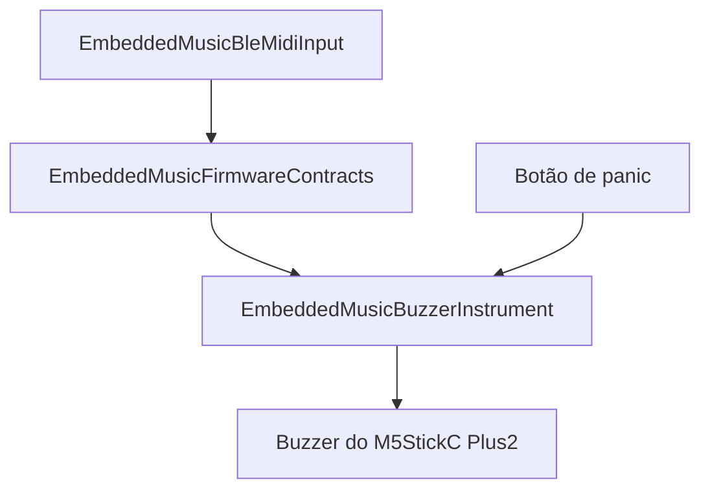
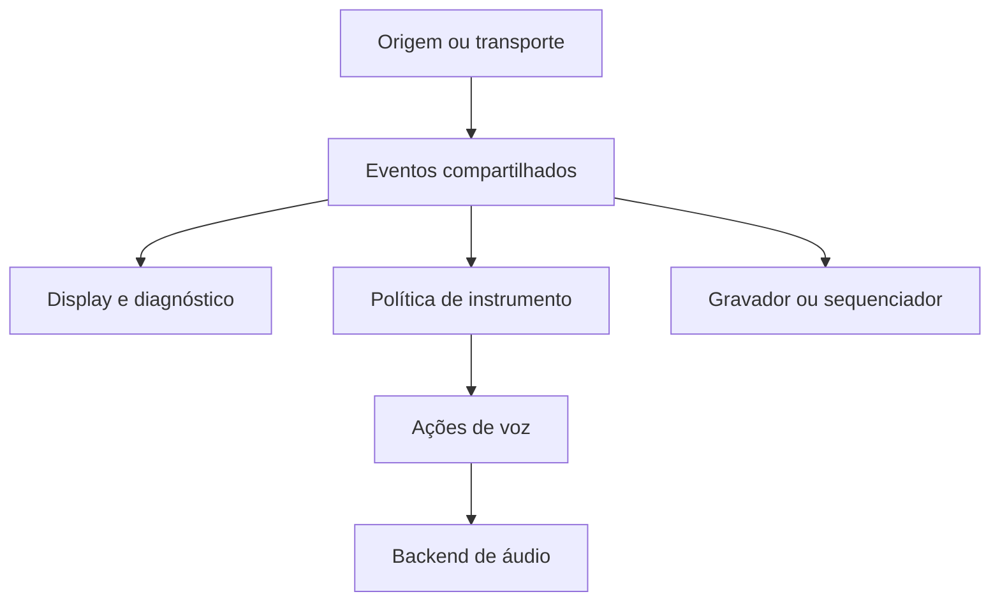

# Ecossistema modular para experimentos musicais embarcados

**Status:** documento vivo de arquitetura e direção

**Plataforma-base atual:** M5StickC Plus2

**Segundo hardware de validação:** M5Stack Core Gray 1.0

**Escopo:** contratos, componentes e experiências musicais embarcadas combináveis

## Resumo

Este projeto investiga como construir pequenos sistemas musicais embarcados a
partir de módulos que tenham valor isoladamente e possam ser combinados por
fronteiras explícitas. Ele não define um sintetizador único nem pretende copiar
um produto comercial específico.

A implementação atual já ultrapassou a primeira prova de conceito. Hoje o
ecossistema possui:

- contratos C++ compartilhados para eventos de nota, pitch bend e ciclo de vida;
- uma entrada BLE MIDI reutilizável;
- um instrumento monofônico com prioridade da última nota;
- um backend de áudio para o buzzer do M5StickC Plus2;
- um showcase que combina esses módulos e já foi tocado com um controlador real;
- testes nativos, builds de firmware, empacotamento PlatformIO e registros de
  validação em hardware.

O M5StickC Plus2 continua sendo a bancada principal. O M5Stack Core Gray será o
segundo alvo real, não para declarar portabilidade por antecipação, mas para
descobrir quais fronteiras sobrevivem a diferenças de placa, transdutor,
controles e configuração.

## O que estamos construindo

O resultado pretendido não é uma aplicação monolítica. É um pequeno ecossistema
no qual origens de eventos, políticas musicais, saídas sonoras e interfaces
possam ser recombinadas.

| Papel | Implementação atual | Possibilidades futuras |
| --- | --- | --- |
| Origem de eventos | BLE MIDI | USB MIDI, sequenciador, controles locais |
| Contrato | nota, pitch bend e desconexão | CCs musicais e outros eventos necessários |
| Política musical | instrumento monofônico, última nota | sustain, modulation, arpejo, polifonia |
| Saída sonora | `SpeakerToneOutput` no buzzer | speaker do Core Gray, oscilador amostrado, I²S |
| Composição | showcase BLE MIDI → buzzer | novos showcases por hardware ou combinação |

Cada nova peça deve resolver um caso concreto. Generalizações surgem quando uma
segunda implementação ou composição revela o que realmente precisa ser comum.

## Estado comprovado

### Contratos compartilhados

O repositório guarda-chuva é também o pacote PlatformIO
`EmbeddedMusicFirmwareContracts`. Ele publica, atualmente:

- `NoteEvent`, com tipo, canal, nota e velocity;
- `PitchBendEvent`, com canal e valor centrado em `-8192..8191`;
- `InstrumentEventSink`, consumido por instrumentos e implementado sem conhecer
  BLE, display ou hardware de áudio;
- `onDisconnected()`, uma notificação de ciclo de vida usada para limpeza segura.

O contrato é deliberadamente pequeno. Control Change ainda não atravessa a
fronteira de instrumento porque nenhum comportamento musical baseado em CC foi
implementado. O receiver pode observar mais mensagens do que o contrato comum
precisa expor.

### Entrada BLE MIDI

O repositório [`midi-receiver`](https://github.com/fczuardi/midi-receiver)
contém dois papéis relacionados, mas separados:

- `BleMidiInput` cuida do transporte BLE MIDI, normalização, fila limitada e
  entrega de eventos ao `InstrumentEventSink`;
- a aplicação receiver acrescenta `AppState`, display e diagnóstico serial para
  tornar o tráfego observável no M5StickC Plus2.

A parte reutilizável é publicada como `EmbeddedMusicBleMidiInput`. Consumidores
não precisam copiar a implementação BLE nem importar o display do receiver.

O receiver já foi validado em hardware com conexão e reconexão, Note On/Off,
acordes, canais, velocity, Control Change, sustain observado em CC64, pitch bend,
fila de eventos e limpeza após desconexão.

### Instrumento monofônico e saída de buzzer

O repositório [`buzzer-instrument`](https://github.com/fczuardi/buzzer-instrument)
publica `EmbeddedMusicBuzzerInstrument`. Internamente, ele separa:

- conversão de nota MIDI para frequência;
- estado monofônico e prioridade da última nota ainda pressionada;
- adaptação de eventos compartilhados para ações do instrumento;
- interface de saída de voz;
- implementação física com `M5.Speaker`.

O instrumento preserva velocity por nota e o backend a mapeia para uma faixa de
volume calibrável. A ação local de panic limpa o estado de teclas mantidas e
silencia imediatamente a saída. O pitch bend já atravessa o contrato e foi
observado no showcase. Testes comparativos indicam que pitch bend audível deve
ser retomado usando rotas BLE que preservam Note Off em tempo real.

### Primeira composição

`showcases/ble-midi-buzzer` combina os três pacotes:

O showcase foi validado com um controlador BLE MIDI real para tocar, soltar e
sobrepor notas, responder à velocity, executar panic, silenciar na desconexão e
reconectar. O caminho completo de pitch bend também foi validado até o log.
Testes posteriores separaram as rotas: My MIDI Hub atrasou Note Off ao rotear a
fita de pitch física do Arturia por USB OTG para BLE, enquanto SynthBridge parou
notas imediatamente tanto com pitch bend na tela quanto com a fita física do
Arturia via USB OTG. Isso recoloca pitch bend audível no plano sem culpar a
arquitetura do showcase.

Essa composição é um exemplo executável, não um quarto produto. Ela pertence ao
guarda-chuva porque prova que pacotes independentes realmente encaixam.

## Princípios

1. **Experimentos pequenos e concluíveis.** Cada slice deve produzir evidência
   observável, documentação e um estado coerente do código.
2. **Componentes com valor próprio.** Receiver, instrumento, backend e showcase
   devem continuar compreensíveis isoladamente.
3. **Fronteiras semânticas.** Instrumentos recebem eventos interpretados, não
   pacotes BLE ou bytes MIDI crus.
4. **Estado pertence ao consumidor.** Display, instrumento e gravador podem
   derivar estados diferentes do mesmo evento.
5. **Recursos previsíveis.** Filas e coleções no caminho crítico usam capacidade
   limitada e evitam alocação dinâmica.
6. **Evolução motivada por uso real.** Uma abstração compartilhada precisa ser
   justificada por produtores, consumidores ou hardwares concretos.
7. **Diferenças ficam nas bordas.** Pinagem, inicialização, calibração, display e
   botões pertencem à composição ou ao backend específico.
8. **Portabilidade demonstrada.** Compilar não basta; a mesma fronteira deve ser
   exercitada em dispositivos reais.
9. **Documentação sem marketing.** Capacidade comprovada, limitação conhecida e
   hipótese futura devem aparecer como categorias diferentes.

## Arquitetura

| Camada | Responsabilidade | Não deve decidir |
| --- | --- | --- |
| Origem/transporte | receber dados, reconstruir mensagens e cuidar da conexão | timbre, prioridade de notas, faixa musical do bend |
| Contratos | representar fatos já interpretados | como cada consumidor reage |
| Instrumento | manter estado musical e produzir ações de voz | detalhes de BLE, display ou pinagem |
| Saída de áudio | transformar ações em som físico | significado de Note On, canal ou CC |
| Composição | escolher módulos, configuração e controles do aparelho | reimplementar as responsabilidades internas |

### Por que não expor BLE MIDI cru

BLE MIDI é uma representação de transporte. Seus pacotes podem conter
timestamps, várias mensagens, running status, mensagens de tempo real
intercaladas e fragmentos de SysEx. Fazer cada consumidor entender esses
detalhes duplicaria parsing e prenderia instrumentos ao Bluetooth.

Estruturas semânticas pequenas permitem que BLE MIDI, USB MIDI, um sequenciador
ou controles locais produzam a mesma intenção musical. Também permitem testar
a política do instrumento no computador, sem rádio ou hardware.

### Mensagens e tempo

O contrato compartilhado ainda não inclui timestamps. Isso é intencional: Note
On, Note Off ou Pitch Bend são úteis sem relógio para execução ao vivo. Quando
um gravador ou sequenciador concreto precisar de tempo, um evento temporizado
poderá envolver a mensagem sem alterar seu significado.

Tempo monotônico de uma performance ao vivo, delta em ticks de um Standard MIDI
File e sincronização externa são domínios diferentes. Eles não devem ser
fundidos antes de existir um caso que escolha a semântica necessária.

## Terminologia: voz

Neste documento, **voz** é uma instância independente de geração sonora capaz
de executar uma nota. Um instrumento monofônico tem uma voz; um instrumento de
oito vozes pode, em princípio, manter oito notas simultâneas.

O termo não significa voz humana ou reconhecimento de fala. Para evitar a
ambiguidade de “comando de voz”, usamos **ação de voz** ou **comando de execução
sonora**.

## Semântica MIDI atual

- **Note On/Off:** usam canal, nota e velocity. Note On com velocity zero é
  normalizado como Note Off na borda produtora.
- **Pitch Bend:** os dois valores de 7 bits do MIDI formam `0..16383`, com centro
  em `8192`. O contrato usa `int16_t` centrado em `-8192..8191`.
- **Alcance do bend:** o evento não contém semitons. O instrumento escolhe a
  faixa musical; o primeiro mapeamento previsto é ±2 semitons.
- **Modulation:** CC1 expressa intensidade, normalmente em `0..127`, mas o
  instrumento escolhe o destino — vibrato, tremolo, timbre ou outro parâmetro.
- **Sustain:** CC64 informa a posição do pedal. A decisão de manter uma nota
  soando pertence ao instrumento.
- **Panic:** não é inferido de silêncio. Pode ser uma ação local explícita ou uma
  reação a desconexão e, futuramente, a CC120/CC123.

Conexão e desconexão são eventos do ciclo de vida do transporte, não mensagens
MIDI. Ainda assim, a desconexão precisa atravessar a composição porque um
instrumento deve silenciar notas que perderam seu Note Off.

## Estado musical e estado de diagnóstico

Não existe um estado global universal. A mesma mensagem pode alimentar modelos
diferentes:

- o receiver guarda conexão, última atividade, contagens e notas observadas;
- o instrumento atual guarda teclas pressionadas, nota ativa e velocity;
- pitch bend pode ser modelado como estado contínuo por uma camada de
  performance futura, mas essa decisão depende de um transporte que não atrase
  Note Off;
- um sequenciador guardará eventos e relações temporais;
- um monitor pode apenas registrar dados.

Essa separação fica especialmente importante com sustain: tecla pressionada e
voz soando deixam de ser equivalentes.

## Estratégia de áudio

### Backend atual

O `SpeakerToneOutput` usa a abstração `M5.Speaker` para tocar tabelas curtas de
onda square ou saw no buzzer passivo do M5StickC Plus2. Ele provou pitches
reconhecíveis, início e parada, troca de nota e resposta básica à velocity.

Esse backend permanece como baseline para Note On/Off, velocity, panic e
showcases simples. Pitch bend audível deixou de ser o próximo critério para
avançar: antes de insistir nele, precisamos pesquisar uma entrada BLE MIDI capaz
de tratar bend como estado contínuo sem atrasar mensagens discretas.

### Backends paralelos

Novos caminhos de áudio devem começar ao lado do backend atual:

- oscilador contínuo por amostras;
- speaker interno do M5Stack Core Gray;
- amplificador I²S MAX98357A;
- DAC I²S PCM5102 para saída de linha;
- outras saídas motivadas por hardware disponível.

Um backend novo não precisa substituir o anterior. Dois exemplos podem continuar
úteis se evidenciarem compromissos diferentes de latência, qualidade, memória,
CPU ou simplicidade.

Polifonia, envelopes, múltiplos osciladores e expressão contínua são
experimentos posteriores. Um futuro retorno a pitch bend deve separar duas
questões: transporte responsivo para eventos discretos e backend sonoro capaz
de atualizar frequência sem comportamento de fila perceptível.

## Segundo hardware: M5Stack Core Gray

O Core Gray 1.0 será introduzido como segundo hardware de validação sem depender
da conclusão de pitch bend audível no Plus2. Ele mantém proximidade suficiente —
ESP32 clássico, BLE e M5Unified — mas troca o buzzer passivo por um speaker
eletromagnético interno de 1 W ligado ao DAC do ESP32.

Essa combinação permite testar, em ordem:

1. A4 e parada no speaker, sem BLE;
2. configuração comum ou backend separado para a saída;
3. build de firmware para o segundo alvo;
4. composição BLE MIDI completa;
5. comparação de volume, clareza, velocity, bend, cliques e latência.

O showcase do Plus2 permanece como referência. Não queremos convertê-lo numa
aplicação universal cheia de condicionais de placa. A composição do Gray pode
escolher outro backend, layout e botão, mantendo contratos e política musical.

## Organização e distribuição

| Local | Responsabilidade |
| --- | --- |
| `embedded-music-experiments` | design, roadmap, contratos compartilhados e showcases |
| `midi-receiver` | experimento de diagnóstico e pacote reutilizável de entrada BLE MIDI |
| `buzzer-instrument` | política monofônica e pacote reutilizável de saída/instrumento |

Os três repositórios usam PlatformIO com Arduino e dependências explícitas. Cada
pacote possui `library.json`; o showcase fixa revisões das dependências para que
uma composição validada possa ser reproduzida. CI verifica contratos, testes
nativos, empacotamento e builds relevantes.

Nem todo módulo lógico precisa virar repositório. Um novo repositório se
justifica quando a peça tem ciclo de vida e valor próprios; uma combinação
executável pequena normalmente pertence a `showcases/`.

## Forma de progresso

O projeto avança por slices pequenos que possam ser construídos, testados,
documentados, revisados e, quando necessário, tocados no hardware. Devlogs
preservam tentativas e descobertas empíricas; este documento descreve a
arquitetura vigente; [`docs/ROADMAP.md`](docs/ROADMAP.md) ordena os próximos
testes; [`docs/BACKLOG.md`](docs/BACKLOG.md) guarda possibilidades de menor
certeza.

O Git e os devlogs contam como chegamos aqui. Este documento não precisa repetir
essa cronologia nem funcionar como changelog.

## Prior art relevante

- [`williamd1k0/m5-synth`](https://github.com/williamd1k0/m5-synth): BLE MIDI,
  formas de onda e múltiplas vozes no M5StickC Plus2; usa topologia Bluetooth
  diferente da entrada atual.
- [`necobit/M5Stack-MIDI-Module`](https://github.com/necobit/M5Stack-MIDI-Module):
  síntese por osciladores e acordes no M5Stack; inspira a exploração paralela de
  áudio amostrado, sem determinar nossa arquitetura.
- [`probonopd/MiniDexed`](https://github.com/probonopd/MiniDexed): Dexed bare
  metal para Raspberry Pi; demonstra uma classe de instrumento muito mais
  completa em hardware diferente.
- [`bstein2379/M5StickC-Plus-Ringtone-Jukebox`](https://github.com/bstein2379/M5StickC-Plus-Ringtone-Jukebox):
  melodias RTTTL no buzzer interno.
- [`CITROMOSEPER/MIDIplayer`](https://github.com/CITROMOSEPER/MIDIplayer):
  reprodução não bloqueante de melodias com FreeRTOS.

Prior art reduz redescobertas. Reuso direto ainda depende de objetivo, licença,
dependências e compatibilidade com as fronteiras existentes.

## Decisões ainda abertas

- Qual comportamento de canal será implementado primeiro?
- Qual caminho de transporte permite tratar pitch bend como estado contínuo sem
  atrasar Note Off?
- O Core Gray reutilizará `SpeakerToneOutput` por configuração ou justificará
  outro backend?
- Qual necessidade concreta fará Control Change atravessar o contrato comum?
- Quando sustain, modulation, arpejo ou sequenciamento passam a ser o próximo
  menor experimento útil?
- Qual comparação justificaria investir em oscilador amostrado ou saída I²S?

## Critérios para boas decisões

Uma mudança está alinhada com esta proposta quando:

- produz uma experiência observável ou resolve uma fronteira concreta;
- mantém transporte, semântica MIDI, política musical e hardware separados;
- não exige uma abstração maior do que os casos existentes;
- preserva recursos previsíveis no caminho crítico;
- deixa diferenças de hardware explícitas;
- registra limitações e evidência de validação;
- continua útil mesmo que nenhuma visão de produto maior seja concluída.

## Norte

O objetivo não é decidir cedo demais qual instrumento final está sendo
construído. É criar um terreno no qual receptores, instrumentos simples,
sequenciadores, arpejadores e diferentes saídas sonoras possam surgir da mesma
linguagem de eventos.

**A unidade de progresso é uma experiência que funciona. A unidade de
arquitetura é uma fronteira que continua clara quando aparece uma segunda
peça — ou um segundo hardware.**
